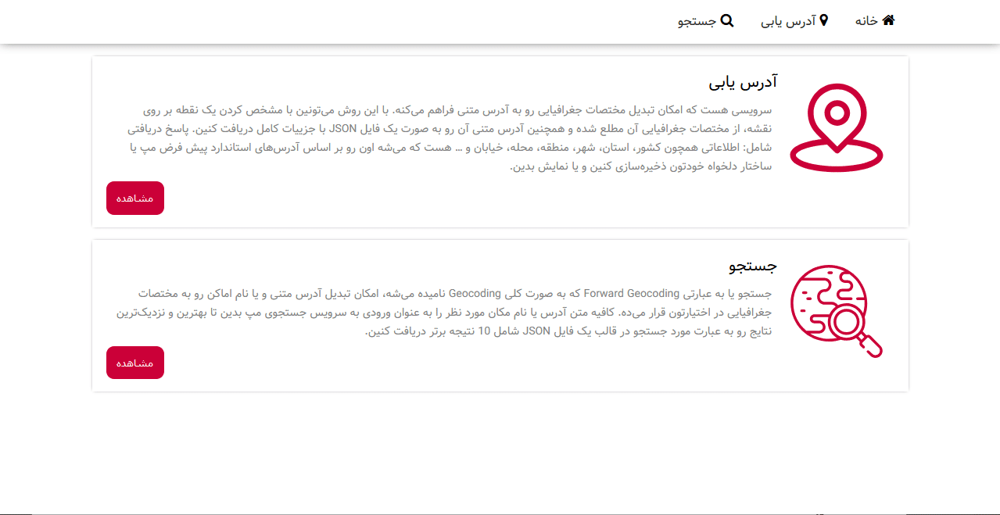

# Mapbox Gl JS + Map.ir SDKs and APIs

## Overview
This project is a **3D map application** developed in **JavaScript** using **Mapbox GL JS** and **Map.ir Tile Service**. The project demonstrates how to integrate 3D map functionality with **Map.ir's geocode and search APIs** to create an interactive mapping experience. The project was developed as a sample for exploring Map.ir and Mapbox GL JS services in **Winter 2020**.

## Key Features
- **3D Map Visualization**: Built with Mapbox GL JS, offering immersive 3D map interactions.
- **Map.ir Integration**: Utilizes Map.ir tile services, geocoding, and search API for enhanced mapping capabilities.
- **Geocode Functionality**: Allows users to search for specific locations using Map.ir's geocode API.
- **Search API**: Provides a search tool for finding points of interest through Map.ir's search API.

## Getting Started
This project was bootstrapped with **Create React App**. You can manage it through various `yarn` commands:

- **Development**: `yarn start` – Runs the app on `http://localhost:3000`, with live reload on changes.
- **Testing**: `yarn test` – Launches the test runner in interactive watch mode.
- **Production Build**: `yarn build` – Builds the app for production, optimizing and minifying files.
- **Configuration Customization**: `yarn eject` – Copies all build configurations for customization. (Note: This operation is irreversible.)

## Demo GIFs
| Functionality  | Demo |
|----------------|------|
| **Geocode**    |  – Shows how to search for a location using the geocode API. |
| **Search API** |  – Demonstrates the use of the search API for points of interest. |

## Requirements
- **Mapbox GL JS** library
- **Map.ir API** access (API key required for geocode and search functionalities)

## Installation
1. Clone the repository.
2. Install dependencies with `yarn install`.
3. Run the app with `yarn start`.

## Additional Information
This project serves as an example to integrate **Map.ir** services with **Mapbox GL JS** to create 3D maps and geospatial functionalities. It is particularly useful for developers looking to implement geocoding and search features with Map.ir APIs in a 3D mapping environment.
